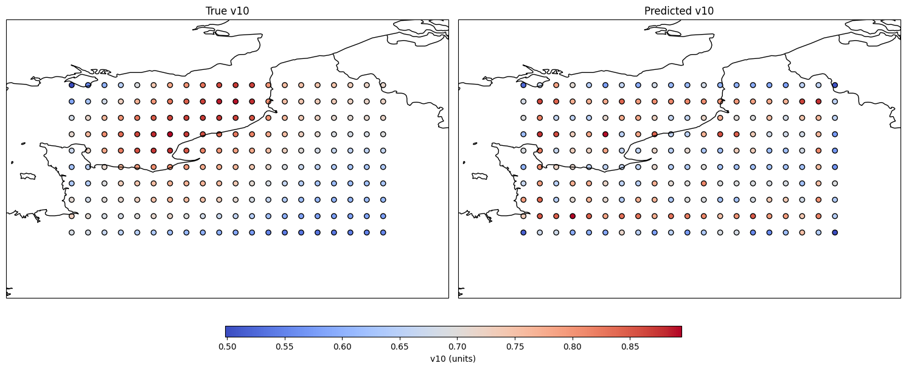

# Graph-Based Weather Forecasting with Hierarchical GNNs

## Project Description
This repository contains our implementation of a Hierarchical Graph Neural Network for probabilistic weather forecasting, developed as part of the "Machine Learning with Graphs" final exam. Inspired by the paper "Probabilistic Weather Forecasting with Hierarchical Graph Neural Networks", we present a simplified yet effective approach focusing on the Northwest coast of France using ERA5 reanalysis data from Copernicus.

## Key Features
- **Variational Graph Convolutional Network** with 3-level hierarchical architecture
- **Spatiotemporal forecasting** of temperature and wind components
- **Probabilistic predictions** through latent space modeling
- **Multi-step forecasting** capability
- **ERA5 data integration** from Copernicus Climate Data Store

## Dataset
We utilize the following data from ERA5 reanalysis:
- **Region**: Northwest France (46°N to 50°N, -6°W to 2°W)
- **Variables**: 
  - 2m temperature (t2m)
  - 10m u-component wind (u10)
  - 10m v-component wind (v10)
- **Resolution**: 0.25° × 0.25° grid
- **Temporal coverage**: Daily aggregates from hourly data
  

  

*Figure 2: Study area covering Brittany and Normandy coasts*

For detailed experiments on forecasting, refer to the notebook [EXPERIMENTS.ipynb](Notebooks/EXPERIMENTS.ipynb).

## Model Architecture
The implementation consists of two main components:

1. **Variational GCN Encoder**:
   - Low-level: in_channels → hidden → hidden/2
   - Mid-level: hidden/2 → hidden/4
   - High-level: hidden/4 → latent (μ, logvar)

2. **GCN Decoder**:
   - 3-layer architecture transforming latent space to predictions

## Training Approach
- **Loss function**: Combination of reconstruction loss (MSE) and KL divergence
- **Optimization**: Adam optimizer with learning rate 0.001
- **Training strategy**: Sequence-to-sequence prediction on graph time series

## Results with basic

| Temperature Prediction | Wind Components |
|------------------------|-----------------|
|  |  |
| *Figure 4: Temperature predictions* | *Figure 5: U10 wind predictions* |
|  |
| *Figure 7: V10 wind predictions* |

## Results with Variational GCN Encoder
|  |  |
| *Figure 8: temperature predictions* | *Figure 9: U10 wind predictions* |
|  | |
| *Figure 10: V10 wind predictions* | 
